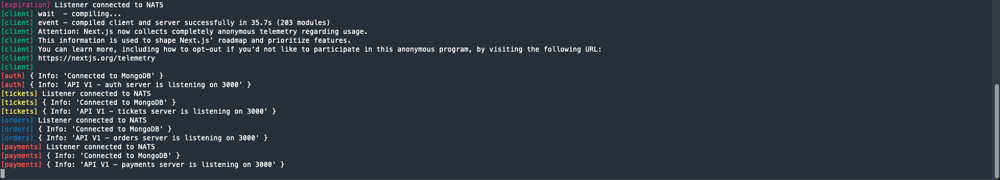

# Microservices Collection

<strong> A Microservices collection whit a basic front end to sell and buy tickets of any event. All Microservices and the Client service ar support with Docker and Kubernetes and these microservices keeps a communication between them through NATS Streaming Service as EVENT-BUS with asynchronous communication<strong>

## This Microservices are builded with follow technologies
 - Node JS + Express
 - Typescript
 - NATS Streaming Service
 - Docker
 - Kubernetes
 - MongoDB
 - Redis
 - Next JS
 - Stripe

## This repository contains this microservices

### Auth
> Handles user authentication and sets a cookie with a JWT inside it. [more details](https://github.com/JoniWaibs/Tickethub-Microservices/tree/master/auth)

### Tickets
> handles creation,   and administration of tickets, that can be selling into the app. [more details](https://github.com/JoniWaibs/Tickethub-Microservices/tree/master/tickets)

### Orders
> Handle orders with tickets, when a ticket will be reserved, this ticket cannot be reserved by another buyer and that order will have an expiration time. [more details](https://github.com/JoniWaibs/Tickethub-Microservices/tree/master/orders)

### Expiration
> Handle the expiration times of orders with reserved tickets. [more details](https://github.com/JoniWaibs/Tickethub-Microservices/tree/master/expiration)

### Payments
> Handle payments. [more details](https://github.com/JoniWaibs/Tickethub-Microservices/tree/master/payments)

### Client
> Handle Frontend views for this flows, builded with Next JS with SSR approach. [more details](https://github.com/JoniWaibs/Tickethub-Microservices/tree/master/client)

<strong>Some features are support from a common library also of my own ownershipt that is calling `@ticket-hub/common`. [You can see more on npm](https://www.npmjs.com/package/@ticket-hub/common)<strong>

## Development

You must have installed [Docker](https://docs.docker.com/get-docker/) and [Kubernetes](https://kubernetes.io/docs/setup/) and additionally you will need [Skaffold](https://skaffold.dev/docs/) for to run all microservices together you must run follow command

```
skaffold dev
```

And you should see something like this in your console

<div>
  
</div>

Then Open [http://localhost:3000](http://localhost:3000) with your browser to see the result.


Enjoy it :rocket:

© 2022 JoniWaibs
